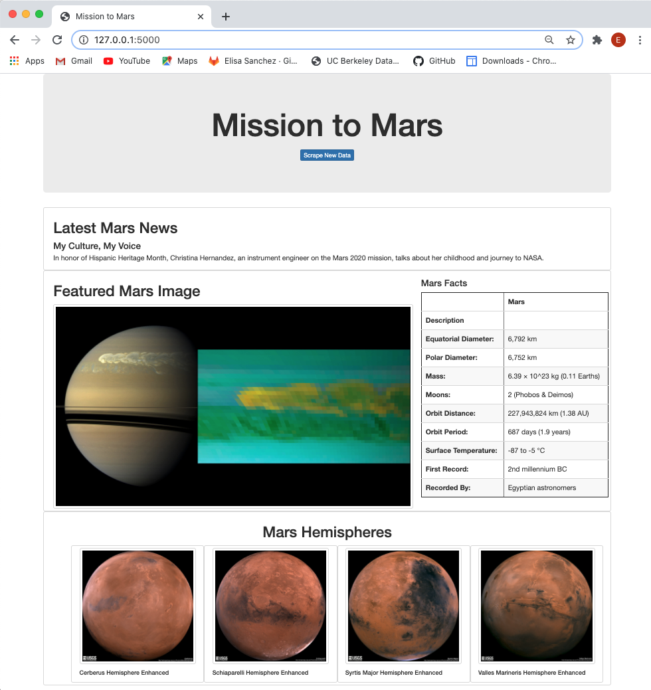

# Mission-to-Mars
The purpose of this exercise was to create a web app by scraping data from nasa.gov. Python, BeautifulSoup and Splinter were used to scrape full-resolution images of Mars’s hemispheres which were then stored on a Mongo database. HTML was used to create a web application to display the data. Here's the result: 

